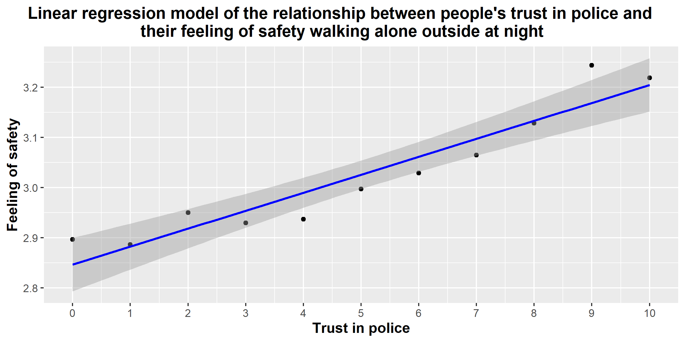

```{r setup, include=FALSE}
knitr::opts_chunk$set(echo = TRUE)
```

# Relationship between people's trust in police and their feeling safe alone outside at night

## Introduction

People usually do not feel being alone outside at night. However, if they know that the police can save them from burglars or killers, they are less stressed about it.

## Methods

We have used the ESS10 dataset and took the variables *trstplc* (Trust in the police) and *aesfdrk* (Feeling of safety of walking alone in local area after dark). The first variable ranges from 0 (No trust at all) to 10 (Complete trust), whereas the second variable ranges from 1 (Very unsafe) to 4 (Very safe).

In our opinion, **the more people trust the police, the safer they feel walking alone in local area after dark.**

## Data preparation

Loading the __tidyverse__ package:

```{r, results = 'hide', message = F, warning = F}
library(tidyverse)
```

We needed to remove the NAs and extract the two variables necessary for the research:

```{r, results = 'hide', message = F}
# Importing the data and removing the NAs ----
ess <- rio::import('Data_orig/ESS10.dta')
ess[ess == '77'] <- NA
ess[ess == '88'] <- NA
ess[ess == '99'] <- NA

# Selecting the variables needed and removing the NAs ----
pol_safe <- ess %>% select(trstplc, aesfdrk)
pol_safe <- na.omit(pol_safe)
pol_safe <- pol_safe %>% mutate(aesfdrk = replace(aesfdrk, aesfdrk %in% c(7, 8, 9), NA))
pol_safe <- na.omit(pol_safe)

# Changing the numbers in a variable so that the higher the number the bigger feeling of safety ----
pol_safe <- pol_safe %>% mutate(aesfdrk = replace(aesfdrk, aesfdrk %in% c(1), 5))
pol_safe <- pol_safe %>% mutate(aesfdrk = replace(aesfdrk, aesfdrk %in% c(2), 6))
pol_safe <- pol_safe %>% mutate(aesfdrk = replace(aesfdrk, aesfdrk %in% c(3), 7))
pol_safe <- pol_safe %>% mutate(aesfdrk = replace(aesfdrk, aesfdrk %in% c(4), 8))

pol_safe <- pol_safe %>% mutate(aesfdrk = replace(aesfdrk, aesfdrk %in% c(5), 4))
pol_safe <- pol_safe %>% mutate(aesfdrk = replace(aesfdrk, aesfdrk %in% c(6), 3))
pol_safe <- pol_safe %>% mutate(aesfdrk = replace(aesfdrk, aesfdrk %in% c(7), 2))
pol_safe <- pol_safe %>% mutate(aesfdrk = replace(aesfdrk, aesfdrk %in% c(8), 1))

# Creating the CSV file with the new data ----
rio::export(pol_safe, here::here("Data_preproc", 'pol_safe.csv'))
```

## Calculating the means

Next, we needed to see the means of the variable *aesfdrk* for each value of the *trstplc* variable:

```{r, message = F, results = 'hide'}
# Importing the file with the data ----
pol_safe <- rio::import('Data_preproc/pol_safe.csv')

# Counting the means for each value of trstplc ----
mean_sft = pol_safe %>% 
  group_by(trstplc) %>%
  summarize(
    safty_mean = mean(aesfdrk, na.rm=T)
  )

# Creating the CSV file with the means ----
rio::export(mean_sft, here::here("Data_preproc", 'mean_sft.csv'))
```

```{r, message = F, echo = F}
library(knitr)
mean_sft %>% kable()
```

## Data visualization

Finally, we created the visualization of the relationship between the variables:

```{r, message = F, warning = F}
# Creating the plot ----
bar_chart = ggplot(mean_sft, aes(x = trstplc, y = safty_mean)) +
  geom_col(alpha = 0.2, col = "black", fill = "blue") +
  scale_x_continuous(breaks = unique(mean_sft$trstplc))+
  ylab("Feeling of safety") +
  xlab("Trust in police") +
  ggtitle("Relationship between people's trust in police and their feeling of safety walking alone outside at night")+
  theme_bw()+ 
  theme(
    plot.title.position = 'plot',
    plot.title = element_text(size=22, face = "bold", hjust = 0.5),
    axis.title.x = element_text(size=16, face="bold"),
    axis.title.y = element_text(size=16, face="bold"))

# Exporting the png file ----
ggsave('bar_chart.png', path = "Figures", width = 1920/120, height = 1080/120, dpi = 300)
```


```{r, message = F, warning = F}
# Importing the file with the data ----
mean_sft <- rio::import('Data_preproc/mean_sft.csv')

# Creating the plot ----
safety <- ggplot(mean_sft, aes(x = trstplc, y = safty_mean)) + 
  geom_point() +
  geom_smooth(method = "lm", col = "blue") +
  scale_x_continuous(breaks = unique(mean_sft$trstplc))+
  ylab("Feeling of safety") +
  xlab("Trust in police") +
  ggtitle("Linear regression model of the relationship between people's trust in police and \ntheir feeling of safety walking alone outside at night") +
  theme_grey()+
  theme(
    plot.title.position = 'plot',
    plot.title = element_text(size=14, face = "bold", hjust = 0.5),
    axis.title.x = element_text(size=12, face="bold"),
    axis.title.y = element_text(size=12, face="bold"))

# Exporting the png file ----
ggsave('safety.png', device = 'png', path = "Figures", plot = safety, width = 8, height = 4)
```



## Conclusion

According to the plot, people indeed feel safer out at night when they trust the police more. Our hypothesis proved to be true.
